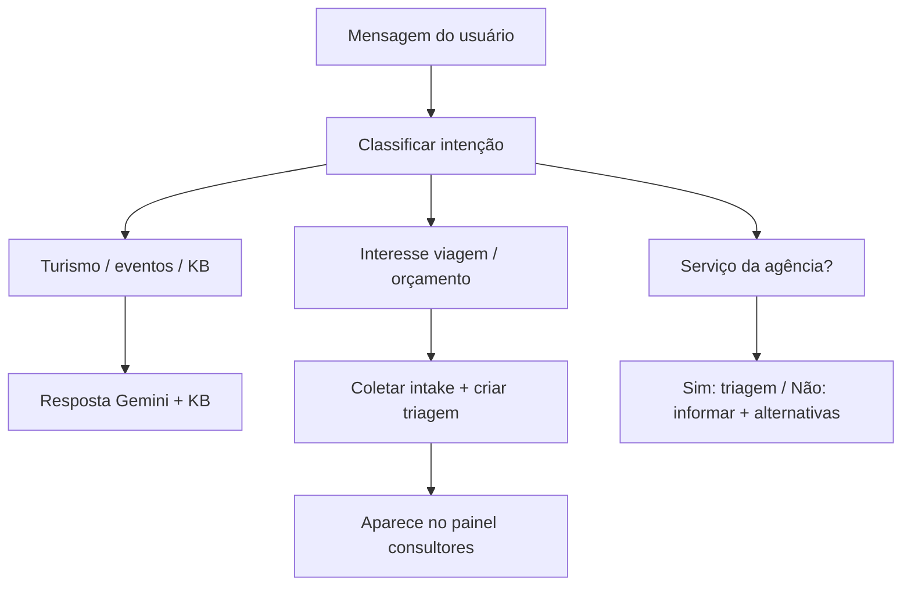

# Ecossistema Guatá — Descubra Mato Grosso do Sul

## Visão geral

O ecossistema une **informação turística** (Descubra MS) com **comercialização via agência** (Guatá Viagens e Turismo), com a capivara **Guatá** como guia — tom caloroso, conversa natural, sem menus robóticos do tipo “digite 1, 2, 3”.

Existem **dois produtos** distintos que compartilham base de conhecimento e eventos:

```
┌─────────────────────────────────────────────────────────────────────────┐
│                     ECOSSISTEMA GUATÁ / DESCUBRA MS                      │
├──────────────────────────────┬──────────────────────────────────────────┤
│   1) DESCUBRA MS (existente) │   2) GUATÁ CHANNEL (novo)                │
│   Site + admin               │   WhatsApp Business (Meta Cloud API)     │
│   Eventos, parceiros, rotas  │   API REST de chat                       │
│   Chat no site               │   Triagem comercial → Guatá Viagens      │
│   KB + prompts no Supabase   │   Painel consultores (este repo)         │
└──────────────────────────────┴──────────────────────────────────────────┘
                              │
                    Supabase compartilhado (leitura)
                    guata_knowledge_base · eventos · ai_prompt_configs
```

---

## 1) Descubra MS (produto existente)

| Aspecto | Detalhe |
|---------|---------|
| **Função** | Portal turístico: site público, painel admin, eventos, parceiros, rotas |
| **Base de conhecimento** | Tabela Supabase `guata_knowledge_base` (perguntas/respostas alimentadas pelo admin) |
| **Prompts de IA** | Tabela `ai_prompt_configs` com `chatbot_name = 'guata'` |
| **Operação** | Equipe publica eventos e mantém a KB; o chat do site usa Gemini + KB |

O Descubra MS é a **fonte da verdade** para conteúdo turístico e eventos. O Guatá Channel **lê** esses dados; não os substitui.

---

## 2) Guatá Channel (produto novo)

| Aspecto | Detalhe |
|---------|---------|
| **Canal** | WhatsApp Business via **Meta Cloud API** (oficial). **Não** usar `whatsapp-web.js` |
| **API** | REST para conversas; futuro: o site pode chamar a mesma API do WhatsApp |
| **Comercial** | Triagem para **Guatá Viagens e Turismo** (agência): pacotes, orçamentos, consultor humano |
| **Painel** | Consultores veem conversas, triagens e formulários coletados pelo bot |
| **Integração** | Lê Supabase do Descubra (KB + eventos); webhook quando evento é publicado |

Componentes previstos (nem todos neste repositório):

| Componente | Onde vive |
|------------|-----------|
| Painel web (consultores) | **guata-connect-hub** (este repo) |
| Webhook Meta + orquestração de mensagens | Backend / Edge (a definir) |
| Motor de IA (Gemini + classificação) | Backend (a definir) |
| Banco operacional (sessões, triagens, posts de canal) | Supabase dedicado ou mesmo projeto |

---

## Números WhatsApp

**Recomendação:** dois números Business separados.

| Linha | Código no sistema | Uso |
|-------|-------------------|-----|
| **A — Descubra MS** | `descubra_ms` | Informação turística, eventos, ecossistema, Guatá Labs |
| **B — Guatá Viagens** | `guata_viagens` | Pacotes, orçamentos, triagem, handoff para consultor |

**Alternativa:** um único número com **modos** de sessão (`informacional` | `triagem` | `humano` | `aguardando`).

No painel, o campo `line` em triagens e conversas reflete essa escolha (badges verde / dourado).

---

## Canal WhatsApp (feed de novidades)

Separado do chat 1:1.

| Fase | Comportamento |
|------|----------------|
| **Fase 1** | Evento publicado no Descubra → webhook monta post (imagem, título, descrição curta, link) → fila **“pronto para publicar”** no painel → operador **copia** e publica manualmente no app do Canal |
| **Fase 2** | Integração automática se a Meta aprovar API adequada para Canal |

A Meta **não** oferece hoje API completa e estável para publicação em Canal como no chat; por isso a Fase 1 é deliberada.

---

## Chatbot — mesmo espírito do site

Princípios (implementação futura no **backend**, não neste painel):

1. **Conversa natural** — Gemini + consulta à KB **antes** de inventar resposta.
2. **Mensagens curtas** no WhatsApp; simular “digitando…” entre blocos.
3. **Sem menu numérico** — classificação de intenção em linguagem livre:
   - Turismo geral (Descubra / ecossistema)
   - Interesse em agência / pacote
   - Serviço que a agência oferece ou não (lista configurável em `AgencyService`)
4. **Tom** — Guatá, capivara guia; caloroso e humano.

Fluxo simplificado de intenção:



---

## Atendimento humano

| Regra | Detalhe |
|-------|---------|
| **Onde** | Consultor atende no **mesmo** número Business (não WhatsApp pessoal) |
| **Modo** | Enquanto `mode = humano`: o **bot não responde** |
| **Retorno do bot** | Cliente envia **"menu"** OU consultor clica **"Encerrar atendimento"** OU **timeout 48h** |

No painel atual:

- Enviar mensagem como consultor define `mode = humano` (mock).
- Botão **“Reativar bot”** em detalhe de triagem chama `release-bot` e volta sessão para `informacional`.

---

## Marca e identidade visual

| Token | Hex | Uso |
|-------|-----|-----|
| Verde floresta | `#1F4D2C` | Primary — Descubra MS, Guatá Labs |
| Dourado | `#C9A24C` | Accent — Guatá Viagens |
| Bege | `#F2EBDD` / `#FAF6EC` | Background |

**Personagem:** Guatá (capivara). **Tipografia no painel:** Inter (corpo) + Fraunces (títulos).

---

## Dados compartilhados (Descubra MS → Guatá Channel)

| Recurso Descubra | Uso no Channel |
|------------------|----------------|
| `guata_knowledge_base` | Respostas informacionais no WhatsApp |
| `ai_prompt_configs` (`chatbot_name = guata`) | System prompt alinhado ao site |
| Eventos publicados | Webhook → rascunho de post de Canal |
| (futuro) Webhook “evento publicado” | Dispara geração de `ChannelPost` |

Variáveis previstas no painel para leitura direta (opcional):

- `VITE_DESCUBRA_SUPABASE_URL`
- `VITE_DESCUBRA_SUPABASE_PUBLISHABLE_KEY`

Cliente em `src/integrations/descubra/client.ts` — hoje só inicializa o client; ingestão de eventos no Canal ainda depende do backend/webhook.
