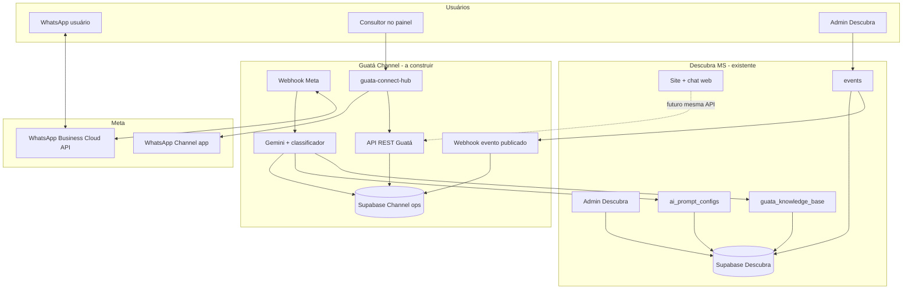

# Arquitetura alvo — Guatá Channel (backend + integrações)

Este documento descreve o que **falta construir** além do painel **guata-connect-hub**, alinhado à visão do ecossistema.

---

## Diagrama de componentes (alvo)



---

## Backend Guatá API (recomendado)

Responsabilidades:

1. **Webhook Meta** — verificar assinatura, receber mensagens, status, typing.
2. **Orquestração de sessão** — `line`, `mode`, timeout 48h, palavra `menu`.
3. **IA** — Gemini; RAG sobre `guata_knowledge_base`; prompts de `ai_prompt_configs`.
4. **Triagem** — fluxo conversacional de intake; persistir `TravelIntake`.
5. **Envio** — Cloud API: texto, mídia, `typing_on` / delays entre blocos.
6. **Admin REST** — implementar contrato já usado pelo painel (`/admin/*`).
7. **Webhook Descubra** — `event.published` → criar `ChannelPost` rascunho.

Opções de hospedagem: Supabase Edge Functions + Postgres dedicado; ou serviço Node/Bun separado; Workers + D1/KV para sessão leve.

---

## Tabelas sugeridas (Supabase Channel — operacional)

Não confundir com tabelas editoriais do Descubra.

| Tabela | Propósito |
|--------|-----------|
| `wa_sessions` | phone, line, mode, last_activity, human_until |
| `wa_messages` | histórico (role, text, wa_message_id) |
| `travel_intakes` | triagens / formulários |
| `channel_posts` | fila Canal |
| `agency_services` | ofertas da agência |
| `channel_settings` | boas-vindas, gatilhos, URLs |
| `consultants` | usuários do painel (auth) |

RLS: consultores só leem triagens/conversas da agência; service role no webhook Meta.

---

## Webhook — evento publicado (Descubra)

Payload sugerido (exemplo):

```json
{
  "event": "event.published",
  "event_id": "uuid",
  "title": "Festival ...",
  "short_description": "...",
  "image_url": "https://...",
  "city": "Campo Grande",
  "starts_at": "2026-06-01",
  "public_url": "https://descubrams.com.br/eventos/..."
}
```

Handler:

1. Validar secret compartilhado.
2. Montar `body` em texto para WhatsApp Channel (título, data, cidade, link).
3. Inserir `channel_posts` com `status = rascunho`.
4. Painel lista e operador copia / marca publicado.

---

## Webhook — Meta Cloud API

Fluxo inbound:

1. `POST /webhooks/whatsapp` (por linha/número se 2 WABAs).
2. Ignorar se `mode === humano` (exceto comando `menu`).
3. Classificar intenção.
4. Se triagem: atualizar intake ou criar novo protocolo `#VG-XXXX`.
5. Responder com mensagens curtas + typing.

Fluxo outbound (consultor no painel):

1. `POST /admin/conversations/:id/reply` → Cloud API send message.
2. Setar `mode = humano` na sessão.

---

## Classificação de intenção (esboço)

| Intenção | Ação |
|----------|------|
| `turismo_geral` | KB + Gemini, linha Descubra |
| `evento` | KB/eventos + link site |
| `interesse_viagem` | Iniciar/continuar intake, linha Viagens |
| `servico_agencia` | Checar `agency_services`; se não atende, explicar com empatia |
| `humano_explicito` | `mode = aguardando`, notificar fila |
| `menu` | Reset para `informacional` se estava em humano |

Gatilhos configuráveis no painel (`palavrasGatilhoTriagem`) alimentam heurística antes do modelo.

---

## Dois números vs um número

| Abordagem | Prós | Contras |
|-----------|------|---------|
| **2 números** | Clara separação marca; webhooks distintos; métricas limpas | Custo Meta, 2 WABAs |
| **1 número + modos** | Um só webhook; usuário não escolhe canal | Classificação mais crítica; mistura KPIs |

O código do painel já suporta **ambos** via `WhatsAppLine` + `SessionMode`.

---

## Roadmap sugerido

| Fase | Entregável |
|------|------------|
| **0** (atual) | Painel mock + contrato API + docs |
| **1** | Backend + webhook Meta (eco Descubra) + persistência real |
| **2** | Gemini + KB Descubra + triagem intake |
| **3** | Auth consultores (Supabase Auth) + deploy painel |
| **4** | Webhook eventos → Canal Fase 1 |
| **5** | API chat unificada para o site |
| **6** | Canal Fase 2 se API Meta permitir |

---

## Checklist de decisões pendentes

- [ ] Backend único: Supabase Edge vs serviço separado
- [ ] Projeto Supabase Channel: mesmo projeto Descubra ou isolado
- [ ] Dois números WABA confirmados na Meta
- [ ] Secrets: `META_VERIFY_TOKEN`, `META_APP_SECRET`, tokens por número
- [ ] URL do webhook Descubra no admin do site
- [ ] Modelo Gemini e limites de custo por conversa
- [ ] Política de retenção de mensagens (LGPD)

---

## Referência cruzada

- Visão de produto: [01-ecossistema.md](./01-ecossistema.md)
- Estado do painel: [02-guata-connect-hub.md](./02-guata-connect-hub.md)
- **Spec detalhada API Node:** [04-guata-channel-api-spec.md](./04-guata-channel-api-spec.md)
- Plano de geração UI: `.lovable/plan.md`
