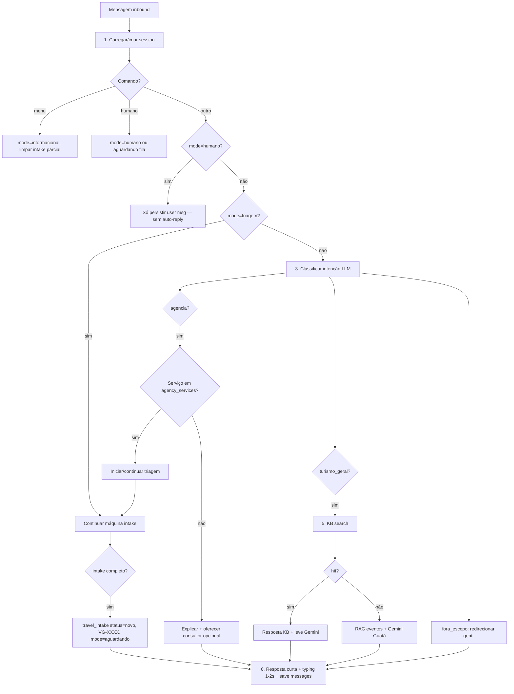

# guata-channel-api — Especificação

Serviço **Node.js + TypeScript** em `../guata-channel-api` (irmão do painel).  
**Status:** implementado (Fase 1) — ver README do repo da API.

Framework: **Fastify** (recomendado: validação JSON Schema, plugins rate-limit, performance) ou Express equivalente.

**Proibido em produção:** `whatsapp-web.js`. Apenas **Meta WhatsApp Cloud API**.

---

## Papel no ecossistema

```mermaid
flowchart LR
  WA[WhatsApp] --> META[Meta Cloud API]
  META --> WH["POST /webhooks/whatsapp"]
  SITE[Site Descubra futuro] --> CHAT["POST /v1/chat"]
  DESCUBRA[Admin Descubra] --> WHE["POST /webhooks/descubra-ms"]
  PANEL[guata-connect-hub] --> ADM["/admin/* JWT"]

  WH --> API[guata-channel-api]
  CHAT --> API
  WHE --> API
  ADM --> API

  API --> PG[(PostgreSQL próprio)]
  API -->|READ| SB_D[(Supabase Descubra)]
  API --> GEMINI[Gemini]
  API --> META
```



| Store | Uso |
|-------|-----|
| **PostgreSQL (próprio)** | Sessões, mensagens, triagens, channel_posts, agency_services, settings, consultores |
| **Supabase Descubra** | **Somente leitura:** `guata_knowledge_base`, `ai_prompt_configs`, `events` / `events_public` (ou cache local) |

---

## Prefixos de rota (importante para o painel)

O painel hoje chama `{VITE_GUATA_API_URL}/admin/...` **sem** prefixo `/v1`.

| Grupo | Prefixo | Auth |
|-------|---------|------|
| Webhooks Meta | `GET/POST /webhooks/whatsapp` | Assinatura Meta + verify token |
| Webhook Descubra | `POST /webhooks/descubra-ms` | `Authorization: Bearer <DESCUBRA_WEBHOOK_SECRET>` |
| Chat unificado | `POST /v1/chat` | API key site ou sessão web (definir) |
| Admin painel | `/admin/*` | **JWT** consultor |
| Health | `GET /health` | Público |

Não colocar admin sob `/v1` sem atualizar `guata-connect-hub/src/lib/api/client.ts`.

---

## Variáveis de ambiente

```bash
# Servidor
PORT=3000
NODE_ENV=production
DATABASE_URL=postgresql://...

# JWT admin (consultores painel)
JWT_SECRET=...
JWT_EXPIRES_IN=7d

# Meta WhatsApp (por linha se 2 números — duplicar sufixo _VIAGENS)
META_VERIFY_TOKEN=...
META_APP_SECRET=...
META_ACCESS_TOKEN=...
META_PHONE_NUMBER_ID=...          # Descubra MS
# META_ACCESS_TOKEN_VIAGENS=...
# META_PHONE_NUMBER_ID_VIAGENS=...

# Descubra Supabase (READ)
DESCUBRA_SUPABASE_URL=...
DESCUBRA_SUPABASE_SERVICE_ROLE_KEY=...   # só leitura server-side; nunca no front

# Webhook Descubra → Channel
DESCUBRA_WEBHOOK_SECRET=...

# Gemini
GEMINI_API_KEY=...
# ou GEMINI_PROXY_URL=...  (proxy interno Descubra)

# Rate limit
RATE_LIMIT_MAX_PER_PHONE=30
RATE_LIMIT_WINDOW_MS=60000

# Opcional: cache eventos (TTL segundos)
EVENTS_CACHE_TTL=300
```

---

## PostgreSQL — schema operacional

Nomes em **snake_case** no banco; API admin devolve **camelCase** igual ao painel (`TravelIntake`, etc.).

### `sessions`

Uma linha por conversa (WhatsApp `phone` ou web `session_id`).

| Coluna | Tipo | Notas |
|--------|------|-------|
| `id` | uuid PK | |
| `channel` | enum `whatsapp`,`web` | |
| `phone` | text nullable | E.164 sem `+`, ex. `5567999110011` |
| `session_id` | text nullable unique | Site: UUID estável |
| `line` | enum `descubra_ms`,`guata_viagens` | Inferido do `phone_number_id` Meta ou default web |
| `mode` | enum ver abaixo | |
| `contact_name` | text | |
| `intake_id` | uuid FK nullable | Triagem em andamento |
| `human_started_at` | timestamptz | Consultor assumiu |
| `human_expires_at` | timestamptz | `human_started_at + 48h` |
| `last_message_at` | timestamptz | |
| `last_message_preview` | text | |
| `metadata` | jsonb | Estado máquina triagem, classificação última, etc. |
| `created_at` / `updated_at` | timestamptz | |

**Modos (`mode`)** — alinhar painel + spec:

| Valor DB | Significado | Bot responde? |
|----------|-------------|---------------|
| `informacional` | Default / pós-`menu` | Sim |
| `triagem` | Coletando intake viagem | Sim (só perguntas do fluxo) |
| `humano` | Consultor ativo (`humano_ativo`) | **Não** (só log inbound) |
| `aguardando` | Intake concluído, fila consultor (`aguardando_consultor`) | Não automático turismo; ack curto ok |

> Spec menciona `humano_ativo` e `aguardando_consultor`: no JSON do painel usar `humano` e `aguardando` (já em `src/types/guata.ts`).

### `messages`

| Coluna | Tipo |
|--------|------|
| `id` | uuid PK |
| `session_id` | uuid FK |
| `role` | `user`,`bot`,`human` |
| `text` | text |
| `wa_message_id` | text nullable |
| `channel` | `whatsapp`,`web` |
| `created_at` | timestamptz |

### `travel_intake`

| Coluna | Tipo | Painel (camelCase) |
|--------|------|---------------------|
| `id` | uuid | `id` |
| `protocol` | text unique | `protocol` ex. `VG-0042` |
| `session_id` | uuid FK | — |
| `phone` | text | `phone` |
| `line` | enum | `line` → `guata_viagens` |
| `status` | enum triagem | `status` → `novo` inicial |
| `name` | text | `name` |
| `origem` | text | `origem` |
| `destino` | text | `destino` |
| `data_ida` / `data_volta` | date | `dataIda`, `dataVolta` |
| `viajantes` | int | `viajantes` |
| `faixa_orcamento` | text | `faixaOrcamento` |
| `tipo_viagem` | text | *(novo — mapear em `preferencias` ou campo extra API)* |
| `hospedagem` | text | *(novo)* |
| `observacoes` | text | `preferencias` / `notes` parcial |
| `assigned_to` | text | `assignedTo` |
| `notes` | text | `notes` internas consultor |
| `created_at` / `updated_at` | timestamptz | `createdAt`, `updatedAt` |

**Protocolo:** sequência `VG-` + 4 dígitos (`VG-0001`).

### `channel_posts`

| Coluna | Painel |
|--------|--------|
| `event_id` | `eventId` |
| `thumbnail` | `thumbnail` ← `image_url` webhook |
| `title`, `city`, `link` | idem |
| `event_date` | `eventDate` |
| `body` | `body` ← `body_preview` formatado |
| `status` | `rascunho` default — **nunca** auto-post Canal Fase 1 |

### `agency_services`

Igual painel: `nome`, `descricao`, `regioes[]`, `ativo`.

### `channel_settings` (singleton ou key-value)

`mensagem_boas_vindas`, `palavras_gatilho_triagem` (json array), URLs webhook read-only para exibir no painel.

### `admin_users` (opcional Fase 1)

email, password_hash, name — ou Supabase Auth depois; JWT emitido no login admin.

---

## Integrações externas

### Meta — `POST /webhooks/whatsapp`

1. **GET** (setup): `hub.mode`, `hub.verify_token`, `hub.challenge` → devolver challenge se token ok.
2. **POST**: validar `X-Hub-Signature-256` com `META_APP_SECRET` (HMAC SHA256 do body raw).
3. Processar apenas `messages` (ignorar status delivery se não necessário).
4. Extrair `from`, `text.body`, `phone_number_id` → resolver `line`.
5. Enfileirar ou processar inline: **`handleInboundMessage(session, text)`** — mesmo núcleo que `/v1/chat`.

Envio outbound:

- `POST https://graph.facebook.com/v21.0/{PHONE_NUMBER_ID}/messages`
- Antes: `typing_on` + `await delay(1000–2000)`
- Mensagens curtas (quebrar > 400 chars se necessário)

### Descubra — leituras Supabase

| Tabela | Uso no pipeline |
|--------|-----------------|
| `guata_knowledge_base` | Search primeiro (match pergunta / embedding se existir no Descubra) |
| `ai_prompt_configs` | `chatbot_name = 'guata'` → system prompt persona |
| `events` ou view `events_public` | RAG se KB miss; cache Redis/mem opcional `EVENTS_CACHE_TTL` |

**Sem escrita** no Supabase Descubra a partir desta API.

### Descubra — `POST /webhooks/descubra-ms`

```http
Authorization: Bearer <DESCUBRA_WEBHOOK_SECRET>
Content-Type: application/json
```

```json
{
  "event": "event.published",
  "event_id": "uuid",
  "title": "...",
  "description": "...",
  "image_url": "https://...",
  "city": "Bonito",
  "starts_at": "2026-08-15",
  "site_url": "https://..."
}
```

Ações:

1. Rejeitar se `event !== "event.published"` ou secret inválido → 401.
2. Montar `body_preview` (texto Canal WhatsApp).
3. `INSERT channel_posts` status `rascunho`.
4. **Não** chamar API de Canal Meta.

### Gemini

- **Classificador leve:** modelo rápido (`gemini-2.0-flash` ou similar) → JSON `{ intent: "turismo_geral"|"agencia"|"fora_escopo" }`.
- **Resposta persona:** modelo principal + system de `ai_prompt_configs` + contexto KB/eventos.
- Chave só no servidor; opcional proxy já usado pelo site Descubra.

---

## Pipeline único de mensagem

Função central: `processMessage(ctx: MessageContext): Promise<ProcessResult>`

Usada por: webhook WhatsApp, `POST /v1/chat`, e (opcional) replay admin.



### Detalhes por passo

**1. Sessão**  
- WhatsApp: lookup por `phone`.  
- Web: lookup por `session_id` (criar se ausente).  
- Atualizar `last_message_at`.

**2. Modo humano**  
- Se `mode === 'humano'`: gravar mensagem `role=user`, **return** sem enviar bot (exceto comandos `menu` / talvez ack mínimo para `humano` explícito na fila).  
- Job cron ou check: se `now > human_expires_at` → `mode = informacional`.

**3. Classificação**  
Intenções da spec (3 valores):

| Intent | Próximo passo |
|--------|----------------|
| `turismo_geral` | KB → miss → eventos/Gemini |
| `agencia` | `matchAgencyService(message)` em `agency_services` ativos |
| `fora_escopo` | Mensagem educada; sugerir turismo MS ou agência se aplicável |

Heurística **antes** do LLM: palavras de `palavras_gatilho_triagem` em settings.

**4. Agência**  
- Serviço encontrado (destino/região/texto): `mode = triagem`, máquina de estados em `session.metadata.intake_state`.  
- Não encontrado: explicar limites; CTA “quer falar com consultor?” → se sim, `mode = aguardando` + notificar (fila).

**5. Turismo geral**  
- Search `guata_knowledge_base` (mesma estratégia do site).  
- Miss: injetar trechos de eventos recentes + Gemini com persona Guatá.  
- Respostas **curtas** (2–4 frases WhatsApp; parágrafos no web).

**6. Entrega**  
- Persistir `messages` (user + bot).  
- WhatsApp: typing + delay 1–2s + send.  
- Web: JSON `{ reply, session_id, mode }`.

**7. Comandos globais (texto livre, case insensitive)**

| Palavra | Efeito |
|---------|--------|
| `menu` | `mode = informacional`, limpar `intake_state`, mensagem de boas-vindas curta |
| `humano` | `mode = aguardando` (fila) ou `humano` se já vinculado consultor — mensagem “em breve um consultor…” |

Admin **release-bot**: mesmo efeito que `menu` + opcional encerrar `human_expires_at`.

---

## Triagem viagem (conversacional)

**Sem menu 1-2-3.** Uma pergunta por vez, tom Guatá.

Ordem sugerida dos slots em `metadata.intake_state`:

1. `nome`  
2. `origem`  
3. `destino`  
4. `datas` (ida + volta — parser NL “15 a 20 de julho”)  
5. `viajantes`  
6. `orcamento` (faixa)  
7. `tipo_viagem` (lua de mel, família, aventura…)  
8. `hospedagem` (pousada, hotel, sem preferência)  
9. `observacoes` (opcional)

Cada turno: extrair slot da resposta (LLM structured ou regex+LLM), confirmar se ambíguo, próxima pergunta.

**Ao concluir:**

```text
INSERT travel_intake (status = 'novo', protocol = 'VG-XXXX')
session.mode = 'aguardando'
Bot: "Perfeito, {nome}! Registrei seu pedido sob o protocolo VG-XXXX.
      Um consultor da Guatá Viagens entra em contato em até 24h. 🦫"
```

---

## `POST /v1/chat` (site futuro)

```http
POST /v1/chat
Content-Type: application/json
X-API-Key: <SITE_CHAT_API_KEY>   # ou JWT sessão site
```

```json
{
  "channel": "web",
  "session_id": "550e8400-e29b-41d4-a716-446655440000",
  "message": "O que fazer em Bonito em julho?"
}
```

```json
{
  "session_id": "550e8400-e29b-41d4-a716-446655440000",
  "reply": "Em julho, Bonito está...",
  "mode": "informacional"
}
```

- `channel: "whatsapp"` reservado para testes internos (normalmente webhook).  
- **Mesmo** `processMessage()` — diferença só no adapter de saída (sem Graph API).

---

## Admin API (JWT) — contrato painel

Todas exigem `Authorization: Bearer <jwt>`.

Implementar exatamente o que `src/lib/api/client.ts` consome:

| Método | Rota | Body / notas |
|--------|------|----------------|
| GET | `/admin/dashboard/stats` | `DashboardStats` |
| GET | `/admin/triages?status=&line=&...` | `TravelIntake[]` |
| GET | `/admin/triages/:id` | |
| PATCH | `/admin/triages/:id` | partial intake |
| POST | `/admin/triages/:id/assume` | `{ consultor }` → status `atribuido` |
| POST | `/admin/triages/:id/release-bot` | session.mode `informacional` pelo phone |
| GET | `/admin/conversations` | lista sem todas msgs ou com últimas N |
| GET | `/admin/conversations/:id` | com `messages[]` |
| POST | `/admin/conversations/:id/reply` | `{ text }` → Meta send + mode `humano` |
| GET | `/admin/channel-posts` | |
| PATCH | `/admin/channel-posts/:id` | `{ status }` |
| GET | `/admin/agency-services` | |
| PUT/PATCH | `/admin/agency-services/:id` | upsert |
| DELETE | `/admin/agency-services/:id` | |
| GET/PATCH | `/admin/settings` | |

**Login (a adicionar no painel depois):** `POST /admin/auth/login` → `{ token, user }`.

`release-bot` e reply do consultor devem usar **Cloud API** no número correto (`line`).

---

## Segurança

| Ameaça | Mitigação |
|--------|-----------|
| Webhook Meta falso | HMAC `X-Hub-Signature-256`, body raw |
| Webhook Descubra falso | Bearer constant-time compare |
| Abuso chat/WhatsApp | Rate limit por `phone` / `session_id` |
| Vazamento keys | Só env servidor; Descubra service role nunca no front |
| JWT | HS256, exp curto, role `consultor` |
| SQL | Queries parametrizadas (pg / Drizzle / Kysely) |

---

## Estrutura de projeto sugerida

```
guata-channel-api/
  src/
    index.ts                 # bootstrap Fastify
    config/env.ts
    db/                      # migrations, pool
    routes/
      webhooks/whatsapp.ts
      webhooks/descubra-ms.ts
      v1/chat.ts
      admin/*.ts
    services/
      message-pipeline.ts    # processMessage
      session.service.ts
      triage.state-machine.ts
      kb.descubra.ts
      gemini.classifier.ts
      gemini.reply.ts
      meta.whatsapp.ts
      channel-posts.service.ts
    middleware/
      jwt.ts
      rate-limit.ts
      raw-body.ts              # para assinatura Meta
  prisma/ ou migrations/
  package.json
```

---

## Decisões alinhadas / pendentes

| Tópico | Decisão proposta |
|--------|------------------|
| ORM | Drizzle ou Kysely + `pg` |
| `tipo_viagem` / `hospedagem` no painel | Estender tipos no hub ou serializar em `preferencias` até UI atualizar |
| Auth admin Fase 1 | JWT próprio; depois Supabase Auth |
| 2 números Meta | Dois `PHONE_NUMBER_ID` + tokens; mapear → `line` |
| Cache eventos | Memória ou Redis; invalidar no webhook `event.published` |

---

## Fora de escopo Fase 1

- Publicação automática WhatsApp Channel  
- `whatsapp-web.js`  
- Escrita no Supabase Descubra  
- Embeddings novos (reusar o que o site já tiver)

---

## Ordem de implementação sugerida

1. Scaffold Fastify + Postgres + migrations  
2. `sessions` + `messages` + `processMessage` stub  
3. `POST /v1/chat` + testes curl  
4. Admin JWT + rotas GET compatíveis com painel  
5. Webhook Descubra → `channel_posts`  
6. Integração Supabase READ (KB + prompts)  
7. Gemini classifier + reply  
8. Máquina triagem + `travel_intake`  
9. Webhook Meta + envio + typing  
10. Rate limit + hardening  

---

## Referências no monorepo

- Painel: `guata-connect-hub` → `VITE_GUATA_API_URL` aponta para esta API  
- Tipos espelho: `src/types/guata.ts`  
- Ecossistema: [01-ecossistema.md](./01-ecossistema.md)
